# PaperPilot

[English](README.md) | [中文](README.zh-CN.md)

[](https://pypi.org/project/paperpilot/)
[](https://pypi.org/project/paperpilot/)
[](LICENSE)
[](https://github.com/CHB-learner/PaperPilot/releases)


PaperPilot is a CLI research agent for AI-related literature review. It turns a natural-language research request into a verified paper corpus, code/PDF collection, evidence-grounded synthesis, and bilingual reports in Markdown, HTML, and PDF.

It is designed as a file-system based research workflow, not a chatbot. Each run creates a self-contained run folder with state, logs, intermediate artifacts, evidence checks, and final reports.

## Highlights

- Natural-language research intake with LLM-assisted query understanding.
- Multi-source paper search: arXiv, Semantic Scholar, OpenAlex, Crossref, and OpenReview.
- Local corpus import with `--user-corpus` for PDF, BibTeX, RIS, Markdown, and text files.
- Research protocol generation with inclusion/exclusion criteria and negative keywords.
- Corpus normalization, DOI/arXiv/title-similarity deduplication, ranking, and relevance screening.
- Code repository detection for GitHub, GitLab, Hugging Face, and project pages.
- Open-access PDF download only; no paywall bypassing.
- Full-text extraction for downloaded PDFs.
- Prompt Registry, Tool Registry, Capability Registry, and event logging.
- Evidence ledger that maps report-level claims to numbered paper citations.
- Review-agent checks for source verification, relevance, citation compliance, and overclaiming risk.
- Canonical bilingual report model with aligned Chinese/English Markdown, HTML, and PDF outputs.

## Installation

From PyPI:

```bash
python -m pip install paperpilot -i https://pypi.org/simple
```

For local development:

```bash
git clone https://github.com/CHB-learner/PaperPilot.git
cd PaperPilot
python -m pip install -e .
```

## LLM Configuration

PaperPilot requires an OpenAI-compatible LLM configuration for query understanding, planning, screening, synthesis, and report generation.

Interactive setup:

```bash
PaperPilot
```

Manual setup:

```bash
PaperPilot config set --base-url https://api.deepseek.com --model deepseek-chat
PaperPilot config import ./api.json
PaperPilot config list
PaperPilot config use deepseek
PaperPilot config show
```

Configuration is stored in:

```text
~/.paperpilot/config.json
```

Configuration priority:

1. Environment variables: `OPENAI_API_KEY`, `OPENAI_BASE_URL`, `OPENAI_MODEL`
2. User config: `~/.paperpilot/config.json`
3. Legacy project file: `llmapi.txt`

Do not commit `api.json`, `llmapi.txt`, `.env`, or any file containing API keys.

## Quick Start

Interactive mode:

```bash
PaperPilot
```

Command mode:

```bash
PaperPilot "RNA inverse folding sequence design" \
  --auto-confirm \
  --max-papers 50 \
  --since-year 2021 \
  --github-filter required \
  --mode apa \
  --quality balanced
```

Use local papers as seed corpus:

```bash
PaperPilot "RNA inverse folding sequence design" \
  --auto-confirm \
  --user-corpus ./papers \
  --user-corpus references.bib
```

Skip PDF downloads:

```bash
PaperPilot "vision language model" --auto-confirm --no-download
```

Inspect or rerun a task:

```bash
PaperPilot inspect runs/<task-id>
PaperPilot resume runs/<task-id>
```

## Architecture

PaperPilot follows a state-machine workflow:

```text
Intake -> Protocol -> Search -> Corpus -> Screening -> Verification -> Synthesis -> Review -> Report
```



```mermaid
flowchart LR
  U[User request<br/>topic + params + local corpus] --> C[Run context<br/>task/state/events]
  C --> P[Prompt Registry]
  P --> QA[Query Understanding Agent]
  QA --> PL[Planner Agent]
  PL --> RP[Research Protocol Agent]
  RP --> ST[Search Tools<br/>arXiv / S2 / OpenAlex / Crossref / OpenReview]
  U --> LC[Local Corpus Import]
  LC --> CB[Corpus Builder]
  ST --> CB
  CB --> RJ[Relevance Judge<br/>core / adjacent / exclude]
  RJ --> VF[Verification + PDF Tools]
  VF --> LM[Literature Matrix]
  LM --> SA[Synthesis Agent]
  SA --> QG[Quality Gate + Reflection]
  QG --> EL[Evidence Ledger<br/>claim -> citation]
  EL --> RA[Review Agents<br/>source / citation / overclaiming]
  RA --> CR[Canonical Report]
  CR --> OUT[ZH/EN Markdown<br/>ZH/EN HTML<br/>ZH/EN PDF]
```

The repository also includes an HTML architecture overview:

- `paperpilot_agent_flow.html`

## Output Artifacts

Each run writes a folder under `runs/<task-id>/` unless `--output-dir` is provided.

Core run files:

- `task.json`: task metadata and parameters.
- `state.json`: stage status.
- `events.jsonl`: stage event stream.
- `manifest.json`: generated artifact list.
- `prompt_manifest.json`: versioned prompt roles and required JSON keys.
- `registries.json`: built-in ToolRegistry and CapabilityRegistry.

Search and corpus files:

- `query_understanding.md`: keyword interpretation and ambiguity analysis.
- `plan.json`: search plan and diversified queries.
- `protocol.json`: research question, scope, inclusion/exclusion criteria, negative keywords.
- `metadata.json`: normalized raw search candidates.
- `user_corpus_log.json`: local corpus import log.
- `corpus.json`: screened full corpus.
- `core_papers.json`: core papers.
- `adjacent_papers.json`: adjacent papers.
- `excluded_papers.json`: excluded papers and reasons.
- `ranked_papers.json`: final report-view papers.

Evidence and quality files:

- `verification.json`: DOI, URL, PDF, and code status.
- `download_log.json`: PDF download status.
- `fulltext/`: extracted PDF text.
- `paper_notes.json`: full-text extraction metadata.
- `literature_matrix.json`: method/task/evidence matrix.
- `synthesis.json`: field overview, method taxonomy, paper summaries, trends, gaps.
- `quality_gate.json`: pass/retry/needs-user-attention verdict.
- `reflection.json`: search quality reflection and retry hints.
- `evidence_ledger.json`: claim-level evidence ledger.
- `review_agent_findings.json`: review-agent checks.

Final reports:

- `report.canonical.json`: shared bilingual report model and citation map.
- `report.zh.md`
- `report.en.md`
- `report.zh.html`
- `report.en.html`
- `report.zh.pdf`
- `report.en.pdf`
- `pdfs/`: downloaded open-access PDFs.

## GitHub / Code Filter

```bash
PaperPilot "retrieval augmented generation" --auto-confirm --github-filter required
```

Filter modes:

- `any`: keep all papers and annotate code availability.
- `required`: final report view keeps papers with detected public code links; full screened corpus is still saved.
- `none`: final report view keeps papers without detected public code links.

## CLI Options

```text
--max-papers INT                 maximum papers in final report view
--since-year INT                 prefer papers since this year
--github-filter any|required|none
--github-search-limit INT        active GitHub search limit
--no-download                    skip PDF downloads
--pdf-limit INT                  maximum PDFs to download
--user-corpus PATH               import local corpus path; repeatable
--mode quick|apa|systematic
--interaction auto|gated
--quality fast|balanced|strict
--include-adjacent               include adjacent papers in matrix/appendix
```

## Development

Run tests:

```bash
python -m unittest discover -s tests
python -m compileall literature_agent
```

Build locally:

```bash
python -m pip install build twine
python -m build
python -m twine check dist/*
```

Publish to PyPI:

```bash
python -m twine upload dist/*
```

## Open Source Notes

Before pushing to GitHub:

- Make sure `.gitignore` is present.
- Do not commit API keys, local run outputs, build artifacts, or virtual environments.
- Add a `LICENSE` file before calling the project open source in a strict legal sense.
- If any PyPI or LLM token was ever committed, revoke it immediately and create a new one.

Suggested first push:

```bash
git init
git add README.md README.zh-CN.md pyproject.toml literature_agent tests paperpilot_agent_flow.html .gitignore LICENSE
git commit -m "Initial open source release"
git branch -M main
git remote add origin https://github.com/CHB-learner/PaperPilot.git
git push -u origin main
```
