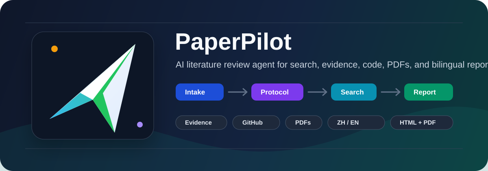

# PaperPilot

[English](README.md) | [中文](README.zh-CN.md)

<p align="center">
  
</p>

[](https://pypi.org/project/paperpilot/)
[](https://pypi.org/project/paperpilot/)
[](LICENSE)
[](https://github.com/CHB-learner/PaperPilot/releases)


PaperPilot 是一个面向 AI 相关方向的命令行文献调研 Agent。你可以用自然语言输入研究需求，它会自动完成需求理解、检索计划、多源论文搜索、语料筛选、代码/PDF 解析、证据综合，并输出中文和英文两套 Markdown、HTML、PDF 报告。

它不是一个简单聊天机器人，而是一个基于文件系统 run folder 的自动化研究工作流。每次运行都会生成独立任务文件夹，保存状态、事件日志、中间产物、质量检查和最终报告。

## 功能亮点

- 支持自然语言输入研究需求，由 LLM 辅助理解关键词和研究范围。
- 分层 Source Registry：默认覆盖 arXiv、Semantic Scholar、OpenAlex、Crossref、OpenReview、PubMed、Europe PMC、bioRxiv、medRxiv、DBLP、ACL Anthology，并支持需要 API key 的扩展来源。
- 支持 `--user-corpus` 导入本地 PDF、BibTeX、RIS、Markdown、文本文件作为用户语料。
- 自动生成研究协议，包括研究问题、纳入/排除标准、时间范围和负面关键词。
- 统一论文模型，支持 DOI、arXiv、标题相似度等多级去重。
- relevance screening：将论文分为核心、相关但非核心、排除。
- 解析 GitHub、GitLab、Hugging Face、项目主页等代码资源。
- 只下载明确开放访问的 PDF，不绕过付费墙。
- 下载 PDF 后抽取全文文本，用于后续综合分析。
- Prompt Registry、Tool Registry、Capability Registry 和事件日志。
- Evidence Ledger：把报告中的关键结论绑定到论文引用编号。
- Review Agents：检查来源验证、相关性、引用合规和过度推断风险。
- 统一 canonical report model，保证中文/英文 Markdown、HTML、PDF 的论文列表和结论一致。

## 安装

从 PyPI 安装：

```bash
python -m pip install paperpilot -i https://pypi.org/simple
```

本地开发安装：

```bash
git clone https://github.com/CHB-learner/PaperPilot.git
cd PaperPilot
python -m pip install -e .
```

## 配置 LLM

PaperPilot 需要 OpenAI-compatible 的 LLM 配置，用于需求理解、检索关键词扩展、筛选、综合和报告生成。

第一次进入交互模式时，如果没有检测到可用配置，系统会引导你配置并测试连通性：

```bash
PaperPilot
```

也可以手动配置：

```bash
PaperPilot config set --base-url https://api.deepseek.com --model deepseek-chat
PaperPilot config import ./api.json
PaperPilot config list
PaperPilot config use deepseek
PaperPilot config show
```

配置可选来源 API Key：

```bash
PaperPilot sources list
PaperPilot sources config core
PaperPilot sources config lens
PaperPilot sources enable core
PaperPilot sources test core
```

配置会缓存到：

```text
~/.paperpilot/config.json
```

配置优先级：

1. 环境变量：`OPENAI_API_KEY`、`OPENAI_BASE_URL`、`OPENAI_MODEL`
2. 用户配置：`~/.paperpilot/config.json`
3. 旧版项目文件：`llmapi.txt`

不要把 `api.json`、`llmapi.txt`、`.env` 或任何包含 API Key 的文件提交到 GitHub。

## 快速开始

进入交互模式：

```bash
PaperPilot
```

示例输入：

```text
调研RNA逆折叠 序列设计 近五年的文献，要求有代码仓库的
```

命令式运行：

```bash
PaperPilot "RNA inverse folding sequence design" \
  --auto-confirm \
  --max-papers 50 \
  --since-year 2021 \
  --github-filter required \
  --sources auto \
  --mode apa \
  --quality balanced
```

导入本地论文作为种子语料：

```bash
PaperPilot "RNA inverse folding sequence design" \
  --auto-confirm \
  --user-corpus ./papers \
  --user-corpus references.bib
```

默认免 key 来源包括 arXiv、Semantic Scholar、OpenAlex、Crossref、OpenReview、PubMed、Europe PMC、bioRxiv、medRxiv、DBLP 和 ACL Anthology。可选 API-key 来源包括 CORE、Lens.org、IEEE Xplore、Springer Nature、Elsevier/Scopus 和 Dimensions。

跳过 PDF 下载：

```bash
PaperPilot "vision language model" --auto-confirm --no-download
```

查看或继续已有任务：

```bash
PaperPilot inspect runs/<task-id>
PaperPilot resume runs/<task-id>
```

## 整体架构

PaperPilot 采用状态机式研究工作流：

```text
Intake -> Protocol -> Search -> Corpus -> Screening -> Verification -> Synthesis -> Review -> Report
```



```mermaid
flowchart LR
  U[用户需求<br/>topic + 参数 + 本地语料] --> C[运行上下文<br/>task/state/events]
  C --> P[Prompt Registry]
  P --> QA[Query Understanding Agent]
  QA --> PL[Planner Agent]
  PL --> RP[Research Protocol Agent]
  RP --> ST[Source Registry<br/>arXiv / S2 / OpenAlex / Crossref / OpenReview<br/>PubMed / Europe PMC / bioRxiv / medRxiv / DBLP / ACL]
  U --> LC[Local Corpus Import]
  LC --> CB[Corpus Builder]
  ST --> CB
  CB --> RJ[Relevance Judge<br/>core / adjacent / exclude]
  RJ --> VF[Verification + PDF Tools]
  VF --> LM[Literature Matrix]
  LM --> SA[Synthesis Agent]
  SA --> QG[Quality Gate + Reflection]
  QG --> EL[Evidence Ledger<br/>claim -> citation]
  EL --> RA[Review Agents<br/>source / citation / overclaiming]
  RA --> CR[Canonical Report]
  CR --> OUT[中文/英文 Markdown<br/>中文/英文 HTML<br/>中文/英文 PDF]
```

仓库中也包含一个 HTML 架构说明页：

- `paperpilot_agent_flow.html`

## 输出文件

默认情况下，每次运行会写入 `runs/<task-id>/`。如果传入 `--output-dir`，则使用指定目录。

核心任务文件：

- `task.json`：任务元数据和参数。
- `state.json`：阶段状态。
- `events.jsonl`：阶段事件流。
- `manifest.json`：产物清单。
- `prompt_manifest.json`：Prompt 角色、版本和 JSON 输出要求。
- `registries.json`：内置 ToolRegistry 和 CapabilityRegistry。
- `source_diagnostics.json`：启用来源、返回数量和来源级错误。

检索和语料文件：

- `query_understanding.md`：关键词理解和歧义分析。
- `plan.json`：检索计划和多样化检索式。
- `protocol.json`：研究问题、范围、纳入/排除标准和负面关键词。
- `metadata.json`：标准化后的候选论文。
- `user_corpus_log.json`：本地语料导入日志。
- `corpus.json`：完整筛选语料。
- `core_papers.json`：核心论文。
- `adjacent_papers.json`：相关但非核心论文。
- `excluded_papers.json`：排除论文和理由。
- `ranked_papers.json`：最终报告视图中的论文列表。

证据和质量文件：

- `verification.json`：DOI、URL、PDF、代码链接状态。
- `download_log.json`：PDF 下载状态。
- `fulltext/`：PDF 全文抽取文本。
- `paper_notes.json`：全文抽取元数据。
- `literature_matrix.json`：任务、方法和证据矩阵。
- `synthesis.json`：领域背景、方法流派、逐篇总结、趋势和研究空白。
- `quality_gate.json`：质量门结果。
- `reflection.json`：检索质量反思和补检索建议。
- `evidence_ledger.json`：claim-level 证据账本。
- `review_agent_findings.json`：复核 Agent 检查结果。

最终报告：

- `report.canonical.json`：中英文共享的报告模型和 citation map。
- `report.zh.md`
- `report.en.md`
- `report.zh.html`
- `report.en.html`
- `report.zh.pdf`
- `report.en.pdf`
- `pdfs/`：下载到的开放 PDF。

## GitHub / 代码仓库筛选

```bash
PaperPilot "retrieval augmented generation" --auto-confirm --github-filter required
```

筛选模式：

- `any`：默认模式，不过滤论文，只标注代码状态。
- `required`：最终报告视图只保留找到公开代码链接的论文；完整核心语料仍会保存。
- `none`：最终报告视图只保留没有找到公开代码链接的论文。

## 常用 CLI 参数

```text
--max-papers INT                 最终报告视图中的最大论文数量
--since-year INT                 优先检索该年份之后的论文
--github-filter any|required|none
--github-search-limit INT        主动 GitHub 搜索数量限制
--no-download                    跳过 PDF 下载
--pdf-limit INT                  最大 PDF 下载数量
--user-corpus PATH               导入本地语料路径，可重复传入
--mode quick|apa|systematic
--interaction auto|gated
--quality fast|balanced|strict
--include-adjacent               在矩阵/附录中包含 adjacent papers
--sources auto|all|core|biomed|cs|configured
--enable-source SOURCE           额外启用某个来源，可重复传入
--disable-source SOURCE          禁用某个来源，可重复传入
```

## 开发

运行测试：

```bash
python -m unittest discover -s tests
python -m compileall literature_agent
```

本地构建：

```bash
python -m pip install build twine
python -m build
python -m twine check dist/*
```

上传 PyPI：

```bash
python -m twine upload dist/*
```

## 开源注意事项

推送到 GitHub 前请确认：

- `.gitignore` 已经存在。
- 不提交 API Key、本地运行结果、构建产物和虚拟环境。
- 不提交 `api.json`、`llmapi.txt`、`.env` 等敏感配置。
- 如果 PyPI token 或 LLM token 曾经进入 Git 历史，立即撤销并重新生成。

推荐首次提交范围：

```bash
git init
git add README.md README.zh-CN.md pyproject.toml literature_agent tests paperpilot_agent_flow.html .gitignore LICENSE
git commit -m "Initial open source release"
git branch -M main
git remote add origin https://github.com/CHB-learner/PaperPilot.git
git push -u origin main
```
