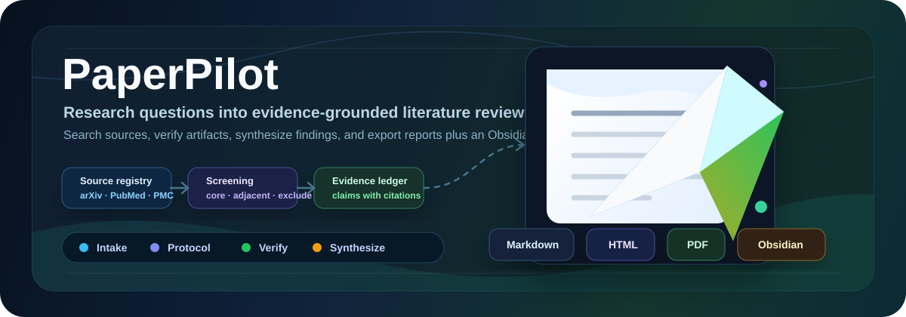

# PaperPilot

[](https://pypi.org/project/paperpilot/)
[](https://pypi.org/project/paperpilot/)
[](LICENSE)
[](https://github.com/CHB-learner/PaperPilot/releases)
[](https://github.com/CHB-learner/PaperPilot)
[](https://pypi.org/project/paperpilot/)
[](https://github.com/CHB-learner/PaperPilot)

[English](README.md) | [中文](README.zh-CN.md) | [项目主页](https://chb-learner.github.io/PaperPilot/)

<p align="center">
  
</p>

PaperPilot 是一个面向 AI 研究场景的 **CLI 文献检索与综述 Agent**。  
它把自然语言研究需求，转化为可追踪、可复现的工作流，并输出中文/英文一致的三端报告（Markdown、HTML、PDF）。

该项目是文件系统驱动的研究工作流，而不是聊天机器人：每次运行都会生成独立的 task 文件夹，完整保留状态、事件日志和中间产物。

## ✨ 我能做什么

- 自然语言解析研究意图，自动形成可执行检索任务
- 生成检索协议与纳入/排除标准
- 多源检索（免费源 + 可选 API 源）并进行统一标准化
- 重排、去重、核心语料筛选与相关性分类
- 校验 DOI/URL/PDF/代码链接可达性（不绕过付费墙）
- 生成带证据链的综述正文与对照矩阵
- 输出完整 run folder 与可追溯日志

## 🚀 特性亮点

### 交互体验
- Rich 终端交互，支持颜色与分组菜单
- 启动页显示当前模型、来源配置与快捷命令
- 支持 `/model`、`/sources`、`/doctor`
- 支持命令模式与交互模式统一工作流

### 检索与筛选
- Query 理解 + 检索计划 + 关键词多样化
- 统一 `Paper` 数据模型
- DOI、arXiv、PMCID/PMID、标题相似度等多级去重
- 核心 / 相关 / 排除三类筛选
- GitHub、GitLab、Hugging Face、项目页等代码链接解析
- 下载开放 PDF（或可选跳过），并提取全文

### 质量与报告
- `quality gate`、反思重检、Evidence Ledger
- Review Agents（来源核验、相关性、引证合规、越界断言检测）
- Canonical report model 驱动中英报告一致
- 论文统一编号引用（[1][2][3]）并自动体现在参考文献中
- Markdown / HTML / PDF 输出一致且可对齐

## 🗂 已集成来源

默认免费来源：

- arXiv
- Semantic Scholar
- OpenAlex
- Crossref
- OpenReview
- PubMed / NCBI E-utilities
- Europe PMC
- bioRxiv / medRxiv
- DBLP
- ACL Anthology
- Papers.cool

可选 API-key 来源：

- DeepXiv / Agentic Data
- CORE
- Lens.org Scholarly API
- IEEE Xplore
- Springer Nature
- Elsevier / Scopus
- Dimensions

## 🛠 安装

从 PyPI 安装：

```bash
python -m pip install paperpilot -i https://pypi.org/simple
```

本地开发安装：

```bash
git clone https://github.com/CHB-learner/PaperPilot.git
cd PaperPilot
python -m pip install -e .
```

## ⚙️ LLM 与来源配置

PaperPilot 需要 OpenAI-compatible 的 LLM 配置才能完成解析、规划、综合和报告生成。首次运行会自动生成可编辑模板：

```text
~/.paperpilot/config.json
```

模板示例：

```json
{
  "active": "default",
  "profiles": {
    "default": {
      "api_key": "",
      "base_url": "",
      "model": "gpt-5.2"
    }
  },
  "sources": {
    "core": {"enabled": null, "api_key": "", "base_url": ""},
    "lens": {"enabled": null, "api_key": "", "base_url": ""},
    "ieee": {"enabled": null, "api_key": "", "base_url": ""},
    "springer": {"enabled": null, "api_key": "", "base_url": ""},
    "elsevier": {"enabled": null, "api_key": "", "base_url": ""},
    "dimensions": {"enabled": null, "api_key": "", "base_url": ""},
    "deepxiv": {"enabled": null, "api_key": "", "base_url": ""}
  }
}
```

说明：

- 可选来源不填 key 不会启用，`enabled: null` 表示“有 key 后自动启用”。
- 配置文件支持直接编辑，也可通过 CLI 命令管理。

命令示例：

```bash
PaperPilot config set --base-url https://api.deepseek.com --model deepseek-chat
PaperPilot config import ./api.json
PaperPilot config list
PaperPilot config use deepseek
PaperPilot config show
PaperPilot --doctor
```

```bash
PaperPilot sources list
PaperPilot sources config core
PaperPilot sources config deepxiv
PaperPilot sources enable core
PaperPilot sources test core
```

交互内可用 `/sources` 与 `/doctor` 快速查看与复查来源配置。

可选来源 API 获取入口：

| 来源 | 获取入口 |
|---|---|
| CORE | https://core.ac.uk/services/api |
| Lens.org | https://docs.api.lens.org/ |
| IEEE Xplore | https://developer.ieee.org/getting_started |
| Springer Nature | https://dev.springernature.com/ |
| Elsevier / Scopus | https://dev.elsevier.com/ |
| Dimensions | https://docs.dimensions.ai/dsl/api.html |
| DeepXiv / Agentic Data | https://data.rag.ac.cn/api/docs |
| Papers.cool | https://papers.cool |

配置优先级：

1. 环境变量：`OPENAI_API_KEY`、`OPENAI_BASE_URL`、`OPENAI_MODEL`
2. 用户配置：`~/.paperpilot/config.json`
3. 兼容文件：`llmapi.txt`

## 🧪 快速上手

交互模式（推荐）：

```bash
PaperPilot
```

命令行模式：

```bash
PaperPilot "RNA inverse folding sequence design" \
  --auto-confirm \
  --max-papers 50 \
  --since-year 2021 \
  --github-filter required \
  --sources auto \
  --mode apa \
  --quality balanced
```

导入本地语料：

```bash
PaperPilot "RNA inverse folding sequence design" \
  --auto-confirm \
  --user-corpus ./papers \
  --user-corpus references.bib \
  --no-download
```

任务管理：

```bash
PaperPilot inspect runs/<task-id>
PaperPilot resume runs/<task-id>
```

## 🧭 流程架构

PaperPilot 的工作流为：

```text
Intake -> Protocol -> Search -> Corpus -> Screening -> Verification -> Synthesis -> Review -> Report
```


附带架构说明页：

- `paperpilot_agent_flow.html`

## 📁 产物目录

每次任务默认落在 `runs/<task-id>/`（或 `--output-dir` 指定目录），核心文件包括：

- `task.json`、`state.json`、`events.jsonl`、`manifest.json`
- `query_understanding.md`、`plan.json`、`protocol.json`
- `metadata.json`、`user_corpus_log.json`、`corpus.json`
- `core_papers.json`、`adjacent_papers.json`、`excluded_papers.json`
- `ranked_papers.json`
- `verification.json`、`download_log.json`、`fulltext/`、`paper_notes.json`
- `literature_matrix.json`、`synthesis.json`、`quality_gate.json`
- `evidence_ledger.json`、`review_agent_findings.json`
- `report.canonical.json`、`report.zh.md`、`report.en.md`
- `report.zh.html`、`report.en.html`、`report.zh.pdf`、`report.en.pdf`
- `pdfs/`、`source_diagnostics.json`、`registries.json`、`prompt_manifest.json`

## 🧩 代码仓库筛选

```bash
PaperPilot "retrieval augmented generation" --auto-confirm --github-filter required
```

说明：

- `any`：保留全部论文，按有无代码进行标注
- `required`：仅保留检测到公开代码的论文（核心语料仍保存）
- `none`：仅保留未检测到公开代码的论文

## 🧪 常用参数

```text
--max-papers INT                 最终报告视图论文数量
--since-year INT                 起始年份
--github-filter any|required|none
--github-search-limit INT        GitHub 搜索数量上限
--no-download                    跳过 PDF 下载
--pdf-limit INT                  PDF 下载上限
--user-corpus PATH               本地语料路径，可重复传入
--mode quick|apa|systematic
--interaction auto|gated
--quality fast|balanced|strict
--include-adjacent               包含 adjacent 论文到矩阵与附录
--sources auto|all|core|biomed|cs|configured
--enable-source SOURCE           启用来源（可重复）
--disable-source SOURCE          禁用来源（可重复）
```

## 🧱 开发与发布

### 预检

```bash
python -m unittest discover -s tests
python -m compileall literature_agent
python -m build
python -m twine check dist/*
```

### 发版建议

```bash
./publish_pypi.sh --dry-run --version 1.4.4
git add -A
git commit -m "chore: release v1.4.4"
git tag -a v1.4.4 -m "v1.4.4"
git push origin main --tags
./publish_pypi.sh --version 1.4.4
```

## 🌟 开源发布建议

- 切勿提交包含 token 的文件：`~/.paperpilot/config.json`、`api.json`、`llmapi.txt`、`.env`
- 建议先配置 `.gitignore`，避免上传运行目录/构建产物
- 保持 LICENSE 与文档同步更新
- 发布 Pages 时使用仓库设置：
  - `Settings` → `Pages`
  - `Build and deployment`
  - `Source: Deploy from a branch`
  - `Branch: main`
  - `Folder: /docs`

### 一键发布

```bash
# 仅预检（不上传）
./scripts/release_everywhere.sh --dry-run

# 完整发布（代码推送/打 tag/GitHub Release/PyPI）
export PYPI_TOKEN='pypi-...'
./scripts/release_everywhere.sh

# 不发布到 PyPI 的本地发版（如仅先推 GitHub）
./scripts/release_everywhere.sh --no-pypi
```

使用 PaperPilot 的场景中，建议在方法、输出和源码版本上给出明确版本号，保证复现。
